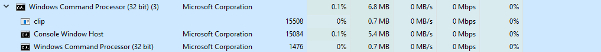

# Clip Window
-------------

Library to clip your mouse from leaving the specified window until stopped. Will only lock while the mouse while the window is active. Spawns in a thread so it's non-blocking and uses very low resources. Uses only the `STL`

### EXAMPLE
----------------

| METHOD  | TYPE | DESCRIPTION |
|:--------:|:-----------:|:----------|
| `clipWindow()` | `Constructor` | Intializes the class with no window specified |
| `clipWindow(HWND)` | `Constructor` | Initializes the class with the window you want watched |
| `.start()` | `void` | Starts locking to window when active |
| `.stop()`    | `void`  | Stops the window from being locked and stops the thread |
| `.updateWindow(HWND)` | `void` | Updates the window |

```cpp
#include <iostream>

#include <clipWindow.h>

void hotKeyListener(clipWindow::clipWindow &clip)
{
	while(true)
	{
		// check if console window is in focus
		bool isConsoleWindowFocussed = (GetConsoleWindow() == GetForegroundWindow());

		// escape
		if (GetAsyncKeyState(VK_ESCAPE) & 0x1 && isConsoleWindowFocussed)
			clip.stop();


		std::this_thread::sleep_for(std::chrono::nanoseconds(1));	// this lowers CPU usage to 0%
	}
}


int main()
{
	HWND handle = FindWindow(NULL, "New Text Document (3) - Notepad");
	HWND handle2 = GetConsoleWindow();
	int count = 0;

	clipWindow::clipWindow clip(handle);
	clip.start();


	std::thread hotkeyThread([=, &clip]()
	{
		hotKeyListener(clip);
	});

	hotkeyThread.detach();

	while(true)
	{
		count++;

		if(count > 100)
		{
			clip.updateWindow(handle2);
		}
		std::cout << "New line " << count << std::endl;
		Sleep(100);
	}

	return 0;
}
```


